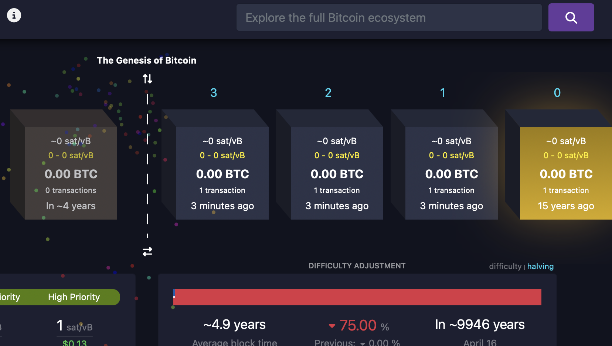
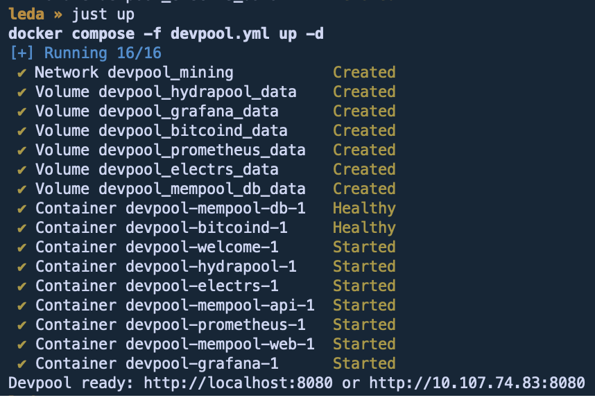
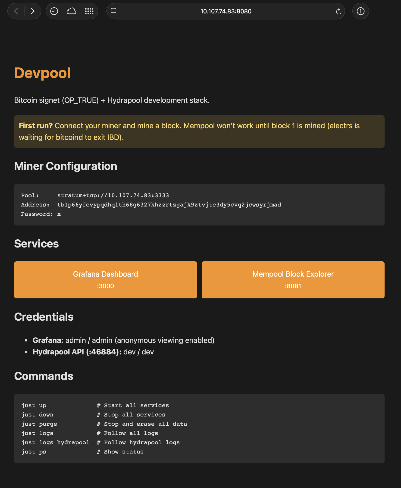

# Devpool

A local [Hydrapool](https://github.com/256-Foundation/Hydra-Pool) + Bitcoin
signet mining stack for development and testing. Run a pre-packaged mining pool
and private Bitcoin test network on your machine using Docker.



## Components

- **Bitcoin Core** running on signet (a test network)
- **Hydrapool** stratum server (where miners connect)
- **Mempool** block explorer (see your blocks!)
- **Grafana** dashboard (pretty charts)

The signet is configured with `OP_TRUE`, which means any miner can produce
blocks without needing special keys. Connect your miner, submit shares, and
watch blocks appear.

Everything is defined in `devpool.yml`, a Docker Compose file. Most service
configuration lives in that file and can be modified to suit your needs.

## Quick Start

```bash
git clone https://github.com/rkuester/devpool.git
cd devpool
just up
```

That's it! You'll see all the containers spin up.



Once it's running, open [http://localhost:8080](http://localhost:8080) in your
browser for the welcome page with all the details.

> Replace `localhost` with the IP address of the devpool machine if your browser
is not running on the same machine. User-facing services are configured to
listen on all network interfaces for remote access.

## Welcome Page



The `just` commands are shortcuts for docker commands. See the `Justfile` to run
them directly if you prefer.

## To Stop

```bash
just down       # Stop all services
just purge      # Stop and erase all data (start fresh)
```

## Prerequisites

Install Docker and Just (a command runner, like make but simpler):

```bash
sudo apt install docker.io docker-compose-v2 just
```

You also need to be in the `docker` group to run containers without sudo:

```bash
sudo usermod -aG docker $USER
```

This adds your user to the docker group. You'll need to log out and back in
(or reboot) for the change to take effect. You can check if it worked by
running `groups` and looking for `docker` in the output.

## About Difficulty

The OP_TRUE signet has the minimum possible network difficulty (~1). This means
any share that meets the *pool* difficulty also meets the *network*
difficulty---so every share becomes a block.

A fast miner submitting shares every few seconds would produce blocks every few
seconds, which overwhelms the block explorer and doesn't reflect real-world
mining behavior.

**Workaround:** We set the pool difficulty high enough that miners only submit
shares (and thus blocks) about once every 30 seconds. The default is 7000,
tuned for ~1 TH/s. To adjust for your hashrate:

```bash
just difficulty 14000    # for ~2 TH/s
```

Or edit `start_difficulty` and `minimum_difficulty` directly in `devpool.yml`.

<div align="center">

| Difficulty | Target Hashrate |
|------------|-----------------|
| 7,000      | ~1 TH/s         |
| 35,000     | ~5 TH/s         |
| 70,000     | ~10 TH/s        |
| 700,000    | ~100 TH/s       |

</div>

## Future Work

The difficulty workaround above works, but it means every share is a block.
This doesn't reflect real-world pool behavior where miners submit many shares
but only occasionally find a block. For more realistic testing, we'd want
shares and blocks to be decoupled.

Two possible fixes (both would be configuration options for development setups):

1. **Upstream submission threshold in Hydrapool:** Only submit shares to
   bitcoind if they exceed a configurable difficulty, allowing normal share
   submission at lower difficulties.

2. **Minimum network difficulty in bitcoind:** A command-line option to set a
   floor on network difficulty in block headers from block 1 onward, so shares
   below it don't become blocks.

## Troubleshooting

**Mempool shows nothing / electrs unhealthy**

This is normal on first start. The block explorer needs at least one block to
work. Connect a miner and wait for it to find a block.

**Containers won't start**

Make sure Docker is running. On Linux, you might need to start the Docker
service: `sudo systemctl start docker`

**Port already in use**

Something else is using port 3333, 8080, 8081, or 3000. Stop the other service
or edit `devpool.yml` to change the port mappings.
